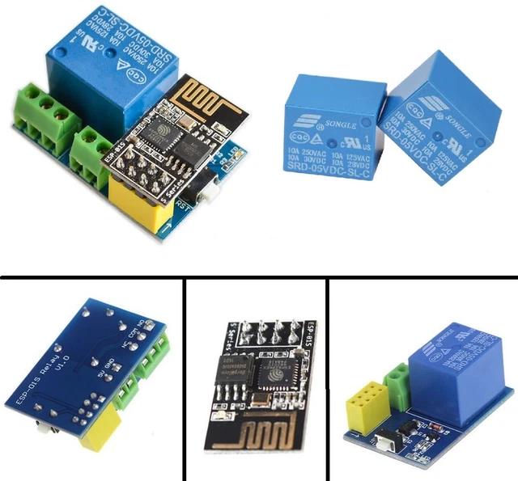
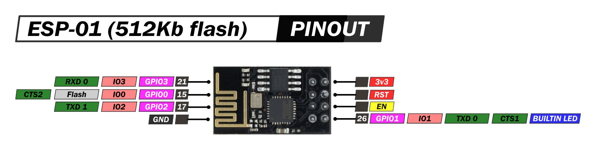

# Hardware Overview

This project uses an ESP8266-01 module and a 5V relay board for WiFi-enabled smart switching.  
Below are reference images for the relay module and ESP8266-01 integration.

## ESP8266-01 Relay Module

**Key Points:**
- The relay module is controlled by the ESP8266-01 via GPIO0.
- GPIO2 can be used for manual switch input or status feedback.
- The relay supports up to 10A switching at 250VAC/30VDC.

## ESP8266-01 Pinout Reference

Refer to the wiring diagram for pin connections and power requirements.
