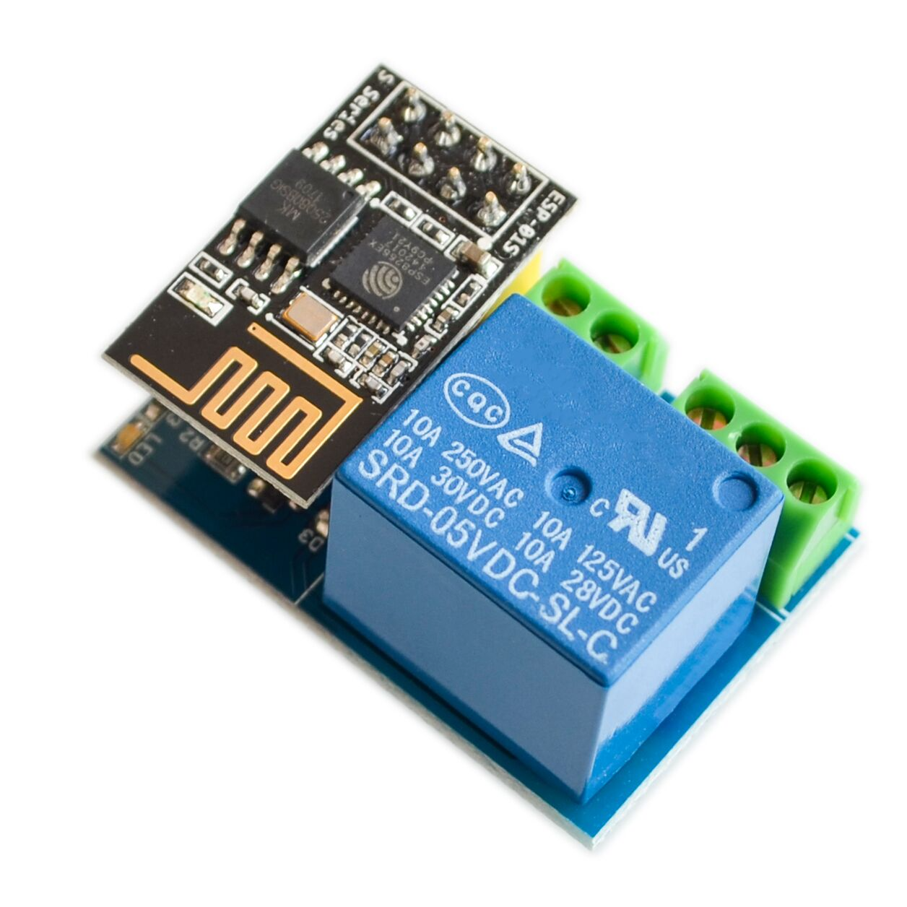

# Google Home & Alexa Integration

The Smart Switch ESP8266 can be controlled via Google Home and Alexa using Arduino IoT Cloud.

## Steps

1. **Program your ESP8266-01** and connect it to Arduino IoT Cloud.
2. **In Google Home or Alexa app:**
   - Go to "Add Device" > "Works with Google/Alexa".
   - Search for "Arduino" and log in with your Arduino Cloud credentials.
   - Your device (e.g., `switch1`) will appear as a switch.
3. **Control with voice:**
   - "Hey Google, turn on switch one"
   - "Alexa, turn off switch one"

**Tip:** The device status will always be in sync, whether toggled manually or via cloud/voice assistant.

For more, see the [Arduino IoT Cloud documentation](https://docs.arduino.cc/cloud/iot-cloud/integrations/google-home/).

---

## Support My Work ☺️

  
  

*Powered By: [J0X](https://github.com/John-Varghese-EH)*
